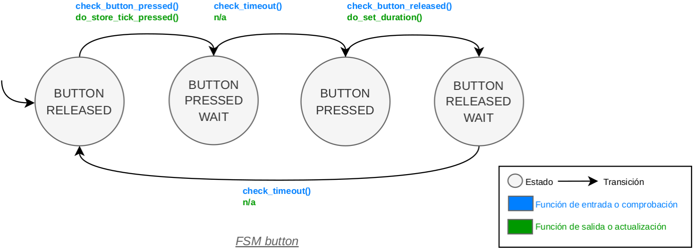
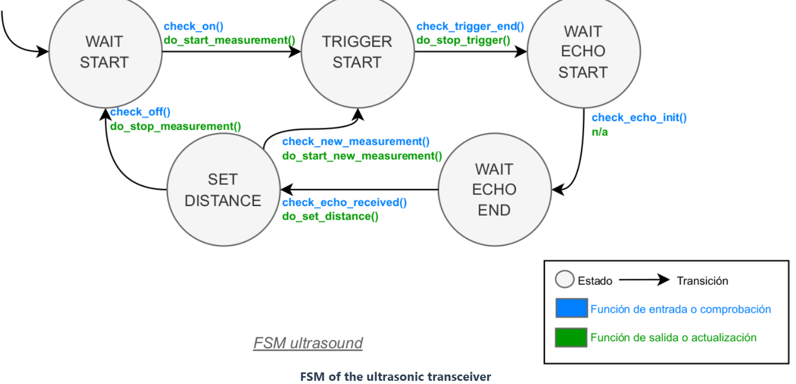
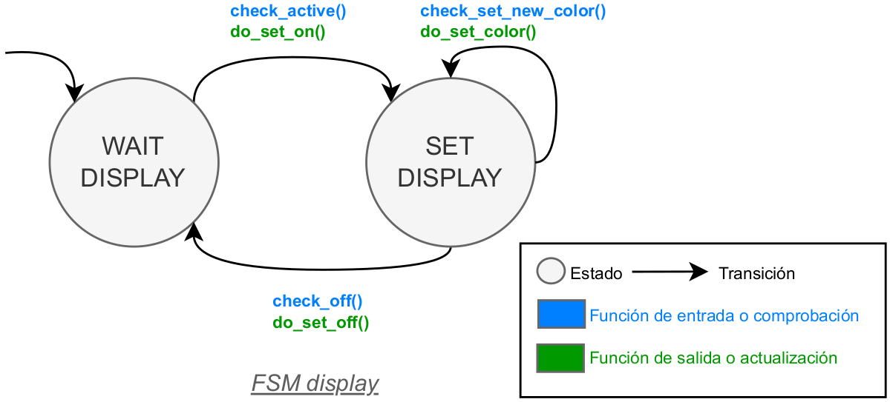
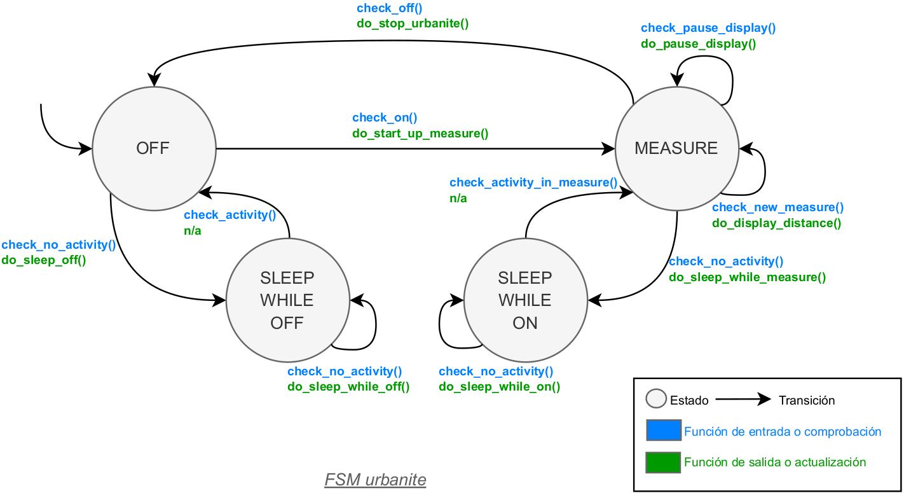
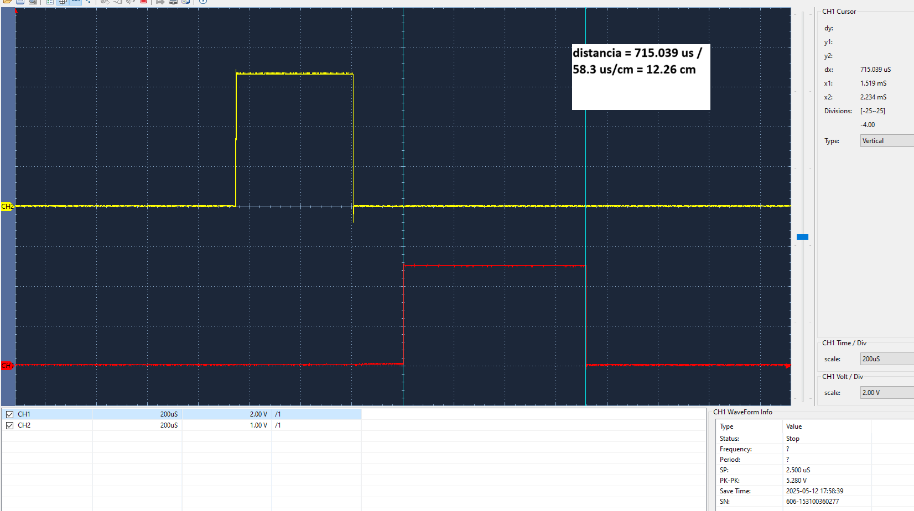

# Urbanite Project

## Autores

* **Mateo Pansard** - email: [mateo.pansard@alumnos.upm.es](mailto:mateo.pansard@alumnos.upm.es)
* **Lucia Petit** - email: [lucia.petit@alumnos.upm.es](mailto:lucia.petit@alumnos.upm.es)

Nuestro sistema base simula el sensor de aparcamiento trasero de un coche. Al presionar el **botón azul**, se activa el sistema como si el coche pusiera la **marcha atrás**. En ese momento, el sistema central envía un pulso al **sensor ultrasónico HC-SR04** para medir la distancia hasta un obstáculo.

El resultado se muestra en el **LED RGB de la placa Nucleo-STM32**, que cambia de color según la proximidad. Para evitar distracciones, el usuario puede **pausar/reanudar la iluminación** con una pulsación corta del botón, excepto en caso de colisión inminente.

El sistema tiene cuatro módulos principales:

    1. Sistema central: Placa Nucleo-STM32 con el microcontrolador STM32F446RE, que gestiona el encendido y la medición.
    2. Control básico: Incluye el botón de usuario y un LED para indicar acciones.
    3. Medición de distancia: Sensor HC-SR04 que emite y recibe ondas ultrasónicas.
    4. Módulo de actuación: LED RGB que indica la distancia al obstáculo.

Para apagar el sistema, se mantiene pulsado el botón durante un tiempo largo. Se muestra un **log en modo depuración**, y hay un video demostrativo disponible.

Our base system simulates a **rear parking sensor** in a car. When the blue button is pressed, the system activates as if the car were shifting into **reverse gear**. At that moment, the central system sends a pulse to the **HC-SR04 ultrasonic sensor** to measure the distance to an obstacle.

The result is displayed on the **RGB LED of the Nucleo-STM32 board**, which changes color based on proximity. To prevent distractions, the user can **pause/resume the LED display** with a short button press, except when a collision is imminent.

The system consists of four main modules:

    1. Central system: Nucleo-STM32 board with the STM32F446RE microcontroller, managing power and measurement.
    2. Basic control: Includes the user button and an LED for feedback.
    3. Distance measurement: HC-SR04 sensor that emits and detects ultrasonic waves.
    4. Actuation module: RGB LED that indicates the obstacle’s distance.

To turn off the system, the button must be held down for a long press. A **log message appears in debug mode**, and a demonstration video is available.

## Version 1

In Version 1, the system works with the user button only. The user button is connected to the pin PC13. The code uses the EXTI13 interrupt to detect the button press.

| Parameter | Value | 
| --------- | --------- | 
| Pin  | PC13  | 
| Mode  | Input   |
| Pull up/ down	  | No push no pull  |
| EXTI | EXTI13  |
| ISR | EXTI15_10_IRQHandler  |
| Priority | 1  |
| Subpriority | 0  |
| Debounce time | 100-200 ms  |

This is the FSM of the button: 

## Version 2

In Version 2, the system adds the ultrasonic transceiver to measure the distance to an object. The trigger pin is connected to the pin PB0, and the echo pin is connected to the pin PA1. The code uses the TIM2, TIM3 and TIM5 timers to control the ultrasonic transceiver.

To measure the distance in centimeters with a timer resolution of 1 microseconds, we can say that 1 cm is equivalent to 58.3 microseconds. The speed of sound is 343 m/s at 20ºC. The ultrasonic transceiver is the HC-SR04.

The characteristics and connections of the ultrasonic transceiver HC-SR04 are shown in the table below:

| Parameter | Value | 
| --------- | --------- | 
| Power supply| 5 V | 
| Current | 15 mA  |
| Pull up/ down	  | No pull   |
| Angle of aperture | 15º |
| Frequency | 40 kHz |
| Measurement range | 2 cm to 400 cm |
| Pins | PB0 (Trigger) and PA1 (Echo)  |
| Mode | Output (Trigger) and alternative (Echo)  |
Timer	|TIM3 (Trigger) and TIM2 (Echo) |

The system uses 3 timers: (i) one to control the duration of the trigger signal, (ii) another to measure the echo time, and (iii) another to measure the timeout between consecutive measurements that we want to make. The timing diagram of the measurements is shown in the figure below.

To generate the **trigger signal**, we will activate (1 logical) the trigger pin for at least 10 microseconds. To control the duration of this signal, we will configure the timer TIM3 as shown in the table below.

|Parameter	|Value|
| --------- | --------- | 
|Timer	|TIM3|
|ISR|	TIM3_IRQHandler()|
|Priority	|4|
|Subpriority|	0|

To **measure the echo time**, we will configure the timer TIM2 in **input capture mode**, which will capture the value of the counter at the moment the echo signal is activated and deactivated.

|Parameter|	Value|
| --------- | --------- | 
|Timer|	TIM2|
|ISR	|TIM2_IRQHandler()|
|Priority	|3|
|Subpriority	|0|

The timer that controls the **timeout between consecutive measurements** is TIM5. The characteristics of this timer are shown in the table below. The FSM will give a value every PORT_PARKING_SENSOR_TIMEOUT_MS milliseconds.

| Parameter| 	Value| 
| --------- | --------- | 
| Timer	| TIM5| 
| ISR| 	TIM5_IRQHandler()| 
| Priority| 	5| 
| Subpriority| 	0| 

This is the FSM of the ultrasonic transceiver:
This is the FSM of the button: 

## Version 3

In Version 3, the system adds the display, which is an RGB LED. The RGB LED is connected to the pins PB6 (red), PB8 (green), and PB9 (blue). The code uses the TIM4 timer to control the frequency of the **PWM** signal for each color. The RGB LED will show the distance to the object detected. The characteristics of the display are shown in the table below.

| Parameter| 	Value| 
| --------- | --------- | 
| Pin LED red	| PB6| 
| Pin LED green| PB8| 
| Pin LED blue| 	PB9| 
| Mode| Alternative| 
| Pull up/ down	| No pull| 
| Timer| TIM4|
| Channel LED red| 	Channel 1| 
|Channel LED green| Channel 3| 
| Channel LED blue	| Channel 4 | 
| PWM mode| PWM mode 1|
|Prescaler | 4 | 
| Period| 3.9ms | 
| Duty cycle LED red|(variable, depends on the color to show) | 
| Duty cycle LED green| (variable, depends on the color to show)| 
| Duty cycle LED blue|(variable, depends on the color to show) |

Para los distintos colores el ciclo de trabajo de los LED será:

|Distance|Color|LED red| LED green| LED blue|
| --------- | --------- | --------- | --------- | --------- |
|0-25$ cm|Red (danger)|100%| 0%| 0%|
|25-50 cm|Yellow (warning)|37%| 37%|0%|
|50-150 cm|Green (no~problem)|0%| 100%| 0%|
|150-175 cm|Turquoise (info)|10%| 35%| 32%|
|175-200 cm|Blue (OK)|0%| 0%| 100%|
|Other distances|Off (inactive)|0%| 0%| 0%|

This is the FSM of the display: 

## Version 4

In Version 4 the system completes its FSM to interact with the user button, the ultrasonic transceiver, and the display. The system will show the distance to the object detected in the display.

This is the FSM of the system: 

Situando un objeto a 12 cm del sensor, esta es la lectura vista desde el osciloscopio : 

## Version 5

Breve descripción de la versión 5.
